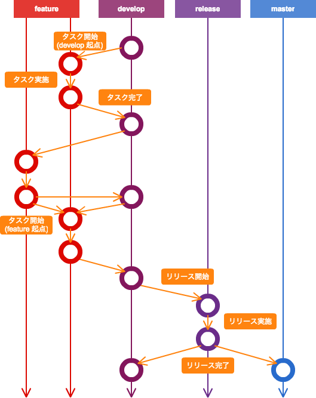

# 概要

本書では CODEYA における開発作業に関するガイドラインを提供する。
本書のステータスは Working Draft であり、本書に対するご意見は pull request にてお送りいただきたい。

## 前提

本書における "MUST"、"MUST NOT"、"SHOULD"、"SHOULD NOT"、"MAY" という表記は [RFC2119](http://www.asahi-net.or.jp/~sd5a-ucd/rfc-j/rfc-2119j.html) における定義に従うものとする。

本書における命名規約の定義には [EBNF](http://ja.wikipedia.org/wiki/EBNF) を使用する。また、必要に応じ自然言語による定義を行う。

## 開発作業

本書では開発作業を以下の通り定める。

| 開発作業名 | 解説                                                       |
|----------|-----------------------------------------------------------|
| タスク    | ロジックの実装や単体テスト、環境設定などプロジェクトに必要な作業を行う。 |
| リリース   | ステージング環境や本番環境へディプロイ可能なモジュールを作成する。     |

## アクター

本書では開発作業に関与するアクターを以下の通り定める。

| アクター名      | 解説                                           |
|---------------|-----------------------------------------------|
| Task Owner    | タスクの作成者。タスクの概要を定め、レビューを実施する。 |
| Task Assignee | タスクの実施者。タスクの実作業を行う。                |

## Git ブランチ構成

本書では Git のブランチ構成を以下の通り定める。

| ブランチ名 | 解説                                                                         | 品質基準        | 命名規則                           |
|----------|-----------------------------------------------------------------------------|----------------|----------------------------------|
| master   | 本番環境にディプロイ可能なブランチ。                                               | 結合試験/UAT完了 | "master" 固定                     |
| release  | ステージング環境にディプロイ可能なブランチ。リリース作業時に develop ブランチより作成する。 | 結合試験完了     | "release/" + yyyyMMdd (リリース日)  |
| develop  | 開発用ブランチ。全開発者の作業結果がマージされるブランチ。                              | 単体試験完了     | "develop" 固定                    |
| feature  | 開発用ブランチ。タスク毎に作成されるブランチ。                                       |                | "feature/" + 任意文字列(半角英数)    |



TBD: プロジェクトを複数併行する場合、develop/foo、develop/bar みたいにする？？

# タスク

タスクではコーディングや環境設定などプロジェクトに必要な作業を行う。
タスクの流れを以下に示す。


## 1) タスク作成

Task Owner は Issue Tracker にタスクを作成する。

## 2) タスク内容合意

Task Owner と Task Assignee 間でタスクの内容について合意する。
特に「具体的な作業内容」「タスクの完了基準」を明確にし、Issue Traker に必ず記載すること。

レビュー工数削減のため、タスクの粒度は最大で 0.5人日程度とする。
それ以上のタスクになる場合はタスク分割もしくはサブタスクを作成し、粒度を小さくすること。

## 3) feature ブランチ作成

Task Assignee は `feature` ブランチを作成する。
`feature` ブランチはタスクもしくはサブタスク毎に作成するものとし、必ず `develop` ブランチを起点とする(`develop 起点 feature`)か、もしくは `feature` ブランチを起点とする(`feature 起点 feature`)ものとする(MUST)。

```bash
% git checkout develop
% git pull
% git flow feature start <Feature Branch Name>
% git push origin feature/<Feature Branch Name>
% git branch --set-upstream-to=origin/feature/<Feature Branch Name> feature/<Feature Branch Name>
```

`feature 起点 feature` ブランチを作成する場合、必ず `Feature Branch Name` に `Parent Task No` を指定するものとする(MUST)。
`Parent Task No` は起点となった feature ブランチの `Task No` を指定するものとする(MUST)。

何らかの理由により feature ブランチを再作成する場合、オリジナルの `Feature Branch Name` に `Serial No` を付与しユニークとなる様にする(MUST)。

```ebnf
Feature Branch Name = Task ID, [ "-", Parent Task No ], "_", Task Summary, [ "_", Serial No ]
Task ID = Project ID, "-", Task No
Parent Task No = Task No
Project ID = Issue Tracker においてプロジェクトをユニークに識別可能な ID。半角英字。
Task No = Issue Tracker のプロジェクトにおいてタスクをユニークに識別可能な No。半角数字。
Task Summary = タスクの内容を簡潔に表す文字列。半角英数字。
Serial No = 通し番号。ブランチ再作成時のみ指定(2〜)。半角数字。
```
※ Feature Branch Name には “feature/” 接頭辞は含めない

<div class="tips_sakaki">

% g co develop
% g pl
% g ffs <Feature Branch Name>
% g ps origin feature/<Feature Branch Name>
% g bup

</div>

## 4) pull request 作成

Task Assignee はタスク作業に先立って pull request を作成する(SHOULD)。
これは、タスク作業中他メンバーへ助言を求める際に pull request のコメント機能を利用することを目的としている。

```bash
% git commit --allow-empty -m “EMPTY”
% git push origin feature/<Feature Branch Name>
% hub pull-request -b develop -m “<Pull Request Name>”
```

```ebnf
Pull Request Name = Issue Tracker におけるタスク名。任意の文字種を利用可能。
```

<div class="tips_sakaki">

% g cme
% g ps origin feature/<Feature ブランチ名>
% g preqd "<Pull Request Name>"

</div>

## 5) タスク作業

Task Assignee はタスクに関わる作業を実施し、必要に応じて commit を作成する。
commit は以下に留意して作成すること。

* commit は明確な責務を持つ
  * commit は明確な一文で示される Commit Summary を持たなければならない(MUST)。
  * commit は Commit Summary にて示されない変更を含んではならない(MUST)。
  * commit は Commit Summary を意識した上で小さく作成し、 「commit 整理」にてマージすると良い(MAY)。
* commit はレビューを意識して作成する
  * commit は適切な Commit Category を持たなければならない(MUST)。
  * commit は Commit Category 及び Commit Summary によりレビュー要否を明確にする。

```bash
% git add --all
% git commit -m “<Commit Message>”
```

```ebnf
Commit Message = Task ID, ":", Commit Category, [ " : ", Commit Summary ], [ "\n", Commit Detail ]
Commit Category = "FEATURE" | "FIX" | "FORMAT" | "REFACTORING" | "WIP" | "EMPTY" | "MISC"
Commit Summary = コミットの内容を一文で表す。Commit Category "WIP" / "EMPTY" 以外では必須。
Commit Detail = コミットの詳細を自然言語で表す。複数行になっても良い。
```

Commit Category は以下の通り定義する。

| Commit Category | 解説                                                                                  | レビュー対象      |
|-----------------|--------------------------------------------------------------------------------------|-----------------|
| FEATURE         | コードに機能追加することを示す。環境設定など、「機能」の追加とならない場合には使用しない。             | 対象             |
| FIX             | コードの機能を修正することを示す。環境設定など、「機能」に対する修正ではない場合には使用しない。        | 対象             |
| FORMAT          | コードのスタイルを変更することを示す。コードの「可読性」改善を行った場合に使用する。                  | 対象外           |
| REFACTORING     | コードに機能的変更を伴わないロジック改善を行うことを示す。コードの「保守性」改善を行った場合に使用する。  | 作業内容により判断 |
| WIP             | 作業中のコミットを示す。 pull request の際に WIP のコミットを残してはならない。                   | 対象外          |
| EMPTY           | 空のコミットを示す。 pull request 作成のために --allow-empty にてコミットを作成する場合に使用する。 | 対象外          |
| MISC            | 上記以外の変更を示す。                                                                    | 作業内容により判断 |

<div class="tips_sakaki">

% g aa
% g cm “<Commit Message>”

</div>

## 6) commit整理、rebase

Task Assignee は push に先立ち、feature ブランチの整理を行う。
commit は 「タスク作業」に記載の Commit Category、Commit Summary を適切に持たなければならない(MUST)。
"WIP" Commit Category を持つ commit はこのタイミングで適切にリネームもしくは別の commit にマージしなければならない(MUST)。

```bash
% git rebase -i HEAD~3
※ 直近 3 commit を rebase にて整理する場合
```

Task Assignee は commit 整理完了後に origin/develop に対し feature ブランチを rebase しなければならない(MUST)。
`feature 起点 feature` の場合、Task Assignee は起点となった `feature` ブランチが `develop` ブランチにマージされていることを確認した後に rebase するものとする(MUST)。
rebase の際、"EMPTY" commit は自動的に削除される。

```bash
% git rebase origin/develop
```

## 7) push

Task Assignee は feature ブランチを push し、Task Owner に Issue Tracker にてレビュー依頼する。

```bash
% git push origin feature/<Feature Branch Name>
```

<div class="tips_sakaki">

% g ps origin “<Commit Message>”

</div>

## 8) レビュー

Task Owner は pull request をレビューする。
レビュー対象となる commit は 「タスク作業」に記載の Commit Category、Commit Summary より判断する。

TBD: レビュー観点を記載

レビューの結果、レビューフィードバックがある場合は pull request に記載し Task Assignee に Issue Tracker にてタスクを差し戻す。

### feature 起点 feature ブランチの場合

* ブランチ名に `Parent Task No` が含まれている場合は起点となる feature ブランチが先に処理されていることを確認する(MUST)。
* commit に他ブランチの `Task ID` を持つものが含まれていないことを確認する(MUST)。

## 9) feature ブランチマージ、削除

Task Owner はレビューを完了し、レビューフィードバックが全て解消された pull request を origin/develop にマージする。
マージにてコンフリクトが発生した場合、Task Assignee に rebase を依頼する(SHOULD)。

引き続き origin/develop にマージされた feature ブランチ(origin/feature)を削除する。
Task Owner は Task Assignee に Issue Tracker にてレビュー完了を通知する。

## 10) タスク完了

Task Assignee は Issue Tracker にてタスクを完了する。

# リリース

TBD :

# 参考資料

* [A successful Git branching model](http://nvie.com/posts/a-successful-git-branching-model/)
