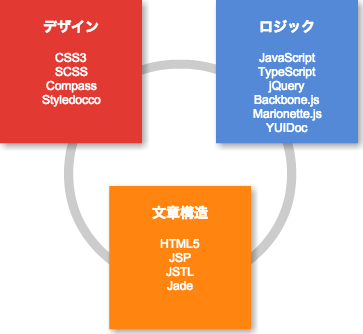
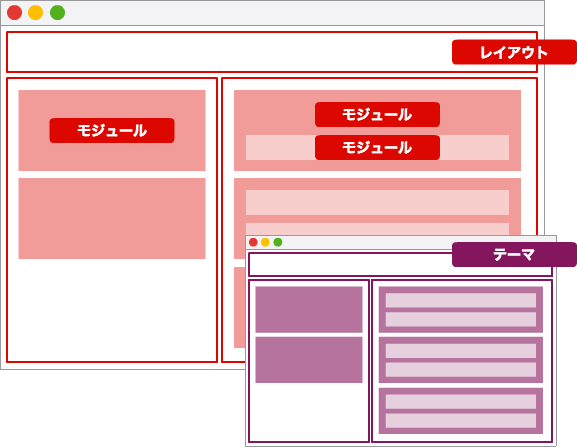
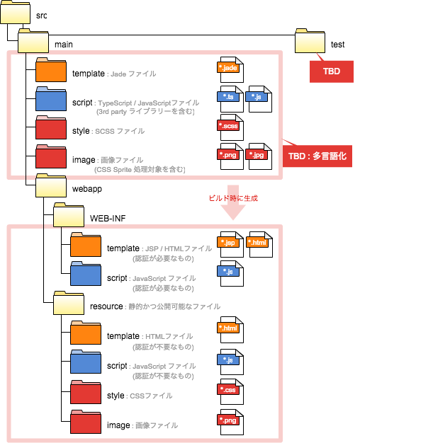
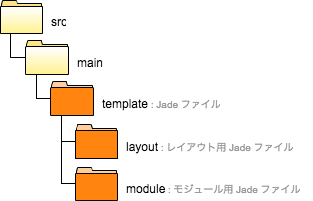
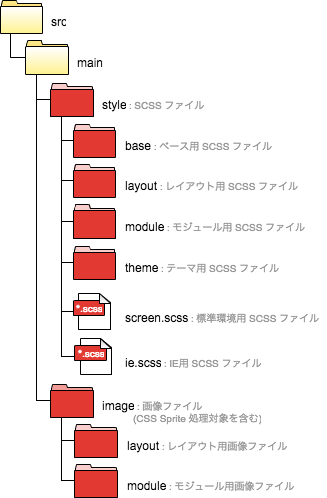

# 概要

本書では Web アプリケーションのフロントエンド開発における規約を定める。
本書のステータスは Working Draft であり、本書に対するご意見は [Pull-request](https://github.com/CODEYA/codeya.github.io/blob/master/documents/frontend-conventions.md) にてお送りいただきたい。

## 前提

本書における "MUST"、"MUST NOT"、"SHOULD"、"SHOULD NOT"、"MAY" という表記は [RFC2119](http://www.asahi-net.or.jp/~sd5a-ucd/rfc-j/rfc-2119j.html) における定義に従うものとする。

本書における命名規約の定義には [EBNF](http://ja.wikipedia.org/wiki/EBNF) 及び [正規表現](http://ja.wikipedia.org/wiki/%E6%AD%A3%E8%A6%8F%E8%A1%A8%E7%8F%BE) を使用する。
正規表現を用いる場合、"【regexp】" を明記し、明記が無い場合は EBNF による定義であるものとする。

本書の命名規約で共通的に使用される定義を以下に記す。

```ebnf
Upper Name = 【regexp】 [A-Z]{1}[A-Za-z0-9]*
Upper Only Name = 【regexp】 [A-Z]{1}[A-Z0-9]*
Lower Name = 【regexp】 [a-z]{1}[A-Za-z0-9]*
Lower Only Name = 【regexp】 [a-z]{1}[a-z0-9]*
```

## フロントエンド構成

本書ではフロントエンドの構成要素を以下の通り定める。
以下の章において、構成要素それぞれについて規約を定める。

* 文書構造
  * デザインに依存しない論理的な文書構造を表す。HTML5 / JSP / Jade を用いる。
* デザイン
  * 文書構造に対し、画面の「見た目」を提供する。CSS3 / SCSS を用いる。
* ロジック
  * 文書構造に対し、画面の「動き」を提供する。JavaScript / TypeScript を用いる。

  

## UI 構成

本書では UI の構成要素を以下の通り定める。

* レイアウト
  * UI 全体をセクションに分割するために使用される。ヘッダ、フッタ、コンテンツ等がレイアウトに相当する。
* モジュール
  * UI として再利用可能なパーツを表す。モジュールが他のモジュールを含むこともある。住所入力フォーム、検索用フォームなどがモジュールに相当する。
* テーマ
  * レイアウト、モジュールにおけるデザインの切り替えを定義する。



## リソース構成

本書ではリソースの構成を以下の通り定める。

* 文書構造
  * 文書構造のソースファイルは `src/main/template` に配置し、ビルドの成果物が `src/main/webapp/WEB-INF/template` もしくは `src/main/webapp/template` に格納される。
* デザイン
  * デザインのソースファイルは `src/main/style` に配置し、ビルドの成果物が `src/main/webapp/style` に格納される。
  * 画像ファイルは `src/main/image` に格納し、ビルドの成果物が `src/main/webapp/image` に格納される。
* ロジック
  * ロジックのソースファイルは `src/main/script` に配置し、ビルドの成果物が `src/main/webapp/WEB-INF/script` もしくは `src/main/webapp/script` に格納される。



* TBD: PDF等その他リソースの配置
* TBD: 多言語対応
* TBD: テスト関連リソースの配置

-------------------------------------------------------------------------
# 文書構造

文書構造は [Jade](http://jade-lang.com/) にて記述し、ビルド時に JSP / HTML5 に変換する。

## リソース構成

本書では文書構造のリソース構成を以下の通り定める。

* レイアウト
  * UI 全体をセクションに分割するために使用される。ヘッダ、フッタ、コンテンツ等がレイアウトに相当する。
  * レイアウト毎に Jade ファイルを分割する。
* モジュール
  * UI として再利用可能なパーツを表す。モジュールに他のモジュールを含んでも構わない。住所入力フォーム、検索用フォームなどがモジュールに相当する。
  * モジュール毎に Jade ファイルを分割する。



## ソースフォーマット

### 基本構造

<figure><figcaption>HTML</figcaption>
<!DOCTYPE html>
<html lang="ja">
<head>
  <meta charset="UTF-8">
  <link /><!-- CSS 読み込み -->
</head>
<body>
  <article>
    <section /><!-- レイアウト -->
  </article>
  <script /><!-- JavaScript 読み込み -->
</body>
</html>
</figure>

<figure><figcaption>JSP</figcaption>
<%@ page contentType="text/html; charset=UTF-8" %>
<%@ taglib uri="http://java.sun.com/jsp/jstl/core" prefix="c" %>
<%@ taglib uri="http://java.sun.com/jsp/jstl/functions" prefix="f" %>
<!DOCTYPE html>
<html lang="ja">
<head>
  <meta charset="UTF-8">
  <link /><!-- CSS 読み込み -->
</head>
<body>
  <article>
    <section /><!-- レイアウト -->
  </article>
  <script /><!-- JavaScript 読み込み -->
</body>
</html>
</figure>

<figure><figcaption>Jade</figcaption>
|<%@ page contentType="text/html; charset=UTF-8" %>
|<%@ taglib uri="http://java.sun.com/jsp/jstl/core" prefix="c" %>
|<%@ taglib uri="http://java.sun.com/jsp/jstl/functions" prefix="f" %>

DOCTYPE html
html(lang="ja")
  head
    meta(charset="UTF-8")
    link //- CSS 読み込み
  body
    article
      section //- レイアウト
    script //- JavaScript 読み込み
</figure>

### Jade ソースフォーマット

| フォーマット         | 設定値                            |
| ------------------ | -------------------------------- |
| 文字エンコーディング   | UTF-8 (No BOM)                   |
| 改行コード           | LF                               |
| 最終行              | new line                         |
| インデント           | 2 spaces (Tab を使用してはならない)  |
| 1行の文字数          | 140                              |
| HTMLエレメント名     | lower case                       |
| HTML属性名          | lower case                       |
| HTML属性値クオート    | double quotation (")             |

### Jade ドキュメンテーションコメント

TBD:

### Jade インラインコメント

コメントは JSP / HTML5 に出力されない形式を使用する。
JSP / HTML5 に出力するコメントは最小限に止める。

```jade
//- will not output within markup
```

### Jade TODO コメント

TODO コメントはインラインコメント同様の形式を使用し、"TODO:" キーワードを明記する。"TODO:" 以外のキーワードを使用してはならない。
必ず「いつ、誰が記載した TODO か」「何故、何が TODO か」「いつ解消予定か」を記載すること。

```jade
//-TODO: [2015/01/01〜2015/01/31 Takahashi] 仕様調整中のためメッセージのデータ構造が暫定。
```

## 命名規約

### Jade ファイル名

Jade ファイル名は lower-hyphen-notation の名詞句とし、".jade" 拡張子を付与する。

```ebnf
Jade File Name = Lower Only Name, { "-", Lower Only Name }
```

### Jade メソッド名

Jade メソッド名は lowerCamelNotation の動詞句 (名詞句もしくは副詞句を続けて良い) とする。

```ebnf
Jade Method Name = Lower Name
```

### Jade 変数名

Jade 変数名は lowerCamelNotation の名詞句とする。
但し、慣習的名称(ループカウンターにおける "i"、"j" 等)は許可する。

```ebnf
Jade Variable Name = Lower Name
```

### HTMLタグ ID 属性

HTMLタグ ID 属性は UPPER_UNDESCORE_NOTATION の名詞句とする。

```ebnf
HTML Tag ID = Upper Only Name, { "_", Upper Only Name }
```

## コーディング規約

### Class の記載

デザインをマルチクラスにて実現するため、クラスセレクターは属性として指定する(MUST)。

```jade
//- GOOD
div(class="menu-item")
//- BAD
div.menu-item
```

### インラインスタイル記述を禁止

CSS を HTML 内にインラインで記載することを禁止とする(MUST NOT)。

```html
<!-- BAD -->
<style>
  .message {}
</style>

<!-- BAD -->
<div style="color: red;"></div>
```

### インラインスクリプト記述を禁止

HTML に JavaScript を記載してはならない(MUST NOT)。
また、JSP に Scriptlet を記載してはならない(MUST NOT)。

```html
<!-- BAD -->
<div onclick="javascript:alert('hello javascript!');" />
<script type="text/javascript">
  alert("hello javascript!");
</script>
```

```jsp
<%-- BAD --%>
<%= message.title %>
<% out.print(message.body); %>
<%! public int getSomething() { return null; } %>
```

### include の使用

include の使用が必要な場合、可能な限り Jade の include や mixin を使用する(SHOULD)。
JSP の `<jsp:include />` や `<%@ include />` は可能な限り使用しない。

### anchor 先のスキーム指定の禁止

anchor タグの href 要素にてスキームを指定してはならない(SHOULD)。
但し、明示的にスキームを切り替える場合を除く。

```html
<!-- GOOD -->
<a href="//www.codeya.co.jp"></a>
<!-- BAD -->
<a href="http://www.codeya.co.jp"></a>
```

-------------------------------------------------------------------------
# デザイン

デザインは [SCSS](http://sass-lang.com/) にて記述し、ビルド時に CSS3 に変換する。
フレームワークとして [Compass](http://compass-style.org/) を採用する。

## リソース構成

本書ではデザインのリソース構成を以下の通り定める。

* ベース
  * エレメントのデフォルトスタイルを定義する。また、複数の SCSS にて共通的に使用される変数、@extend を定義する。
  * ベースではIDセレクター、クラスセレクターを使用してはならない。
* レイアウト
  * UI 全体をセクションに分割するために使用される。ヘッダ、フッタ、コンテンツ等がレイアウトに相当する。
  * レイアウト毎に SCSS ファイルを分割する。
* モジュール
  * UI として再利用可能なパーツを表す。モジュールに他のモジュールを含んでも構わない。住所入力フォーム、検索用フォームなどがモジュールに相当する。
  * モジュール毎に SCSS ファイルを分割する。但し、類似のモジュールを同一ファイルにて管理しても構わない。
* テーマ
  * レイアウト、モジュールにおけるデザインの切り替えを定義する。
  * テーマ毎に SCSS ファイルを分割する。



## ソースフォーマット

### 基本構造

```css
.message {
  color: #000000;
  background-color: #FFFFFF;
  -moz-box-shadow: 3px 0px 5px rgba(0, 0, 0, 0.05);
  -webkit-box-shadow: 3px 0px 5px rgba(0, 0, 0, 0.05);
  box-shadow: 3px 0px 5px rgba(0, 0, 0, 0.05);
}
.message--warning {
  color: #FF0000;
  background-color: #FFDDDD;
}
```

```scss
$shadow-color: #000000;

.message {
  color: #000000;
  background-color: #FFFFFF;
  @include single-box-shadow(3px, 0px, 5px, null, $shadow-color, null)
}
.message--warning {
  color: #FF0000;
  background-color: #FFDDDD;
}
```

### SCSS ファイルフォーマット

| フォーマット         | 設定値                            |
| ------------------ | -------------------------------- |
| 文字エンコーディング   | UTF-8 (No BOM)                   |
| 改行コード           | LF                               |
| 最終行              | new line                         |
| インデント           | 2 spaces (Tab を使用してはならない)  |
| 1行の文字数          | 140                              |
| CSS属性名           | lower case                       |
| CSS属性値(色指定)    | upper case                       |

### SCSS ドキュメンテーションコメント

[Styledocco](http://jacobrask.github.io/styledocco/) 形式のドキュメンテーションコメントを記載する。


/*
# メッセージ表示

メッセージを表示する。
メッセージのレベルを `.message-error`、`.message-warning`、`.message-info` にて指定する。

```
<div class="message message-error">メッセージ</div>
```
*/
.message {

}


### SCSS インラインコメント

コメントは CSS3 に出力されない形式を使用する。
CSS3 に出力するコメントは最小限に止める。

```scss
// will not output within markup
```

### SCSS TODO コメント

TODO コメントはインラインコメント同様の形式を使用し、"TODO:" キーワードを明記する。"TODO:" 以外のキーワードを使用してはならない。
必ず「いつ、誰が記載した TODO か」「何故、何が TODO か」「いつ解消予定か」を記載すること。

```scss
//TODO: [2015/01/01〜2015/01/31 Takahashi] 仕様調整中のためメッセージのフォントカラーが暫定値。
```

## 命名規約

### SCSS ファイル名

SCSS ファイル名は lower-hyphen-notation の名詞句とし、".scss" 拡張子を付与する。
SCSS ファイル名は原則レイアウト名もしくはモジュール名を使用するものとする。
複数のモジュールを同一 SCSS ファイルに格納する場合は内包するモジュールを適切に表す名称とする。

```ebnf
SCSS File Name = Lower Only Name, { "-", Lower Only Name }
```

### SCSS モジュール用クラスセレクター名

モジュール用クラスセレクター名はモジュール名、エレメント名、モディファイヤー名から構成される。

モジュール名はモジュールの識別に使用される名称であり、 lower-hyphen-notation の名詞句とする。

エレメント名はモジュールを構成する要素の識別に使用される名称であり、 lower-hyphen-notation の名詞句とする。

モディファイヤー名はモジュールのバリエーションを示す名称であり、 lower の名詞句もしくは副詞句とする。
モディファイヤーの中でモジュールの状態を示すものをステートと呼び、ステート名は "is-" 接頭辞を持つ副詞句とする。
例) "is-active", "is-collapsed", "is-hidden", "is-visible", "is-draggable"

```ebnf
Module Class Selector Name = Module Name, [ "__", Element Name ], [ "--", Modifier Name ]
Module Name = Lower Only Name, { "-", Lower Only Name }
Element Name = Lower Only Name, { "-", Lower Only Name }
Modifier Name = Lower Only Name | State Name
State Name = "is-", Lower Only Name
```

### SCSS テーマ用クラスセレクター名

TBD:

### SCSS @extend 名

SCSS @extend 名は lower-hyphen-notation の名詞句とする。
SCSS @extend 名は @extend の表現するデザインを適切に表す名称とする。

```ebnf
SCSS Extend Name = Lower Only Name, { "-", Lower Only Name }
```

### SCSS 変数名

SCSS 変数名は変数のターゲットとなるレイアウト名もしくはモジュール名と属性名から構成される。

属性名は一般的に CSS の属性名 ("background-color", "font-size" 等) を指定するが、それ以外の文字列を指定する場合は lower-hyphen-notation の名詞句とする。

```ebnf
SCSS Variable Name = [ SCSS Variable Target Name, "_" ], Attribute Name
SCSS Variable Target Name = Layout Class Selector Name | Module Class Selector Name
Attribute Name = Lower Only Name { "-", Lower Only Name }
```

## コーディング規約

### エレメントの利用用途

エレメントは以下の用途で利用するものとする(MUST)。

| エレメント        | 利用用途                   |
|-----------------|--------------------------|
| article         | 画面全体(body 直下)        |
| section         | レイアウト                 |
| div             | 汎用的なブロックエレメント    |
| span            | 汎用的なインラインエレメント   |
| p               | テキストの段落              |
| a               | ハイパーリンク、ボタン       |
| ul / ol / li    | 列挙                      |
| h1, h2, h3      | レイアウトにおけるタイトル    |
| h4, h5, h6      | モジュールにおけるタイトル    |

TBD: <a> の用途を要確認。

### マルチクラスによるデザイン管理

単一エレメントに対し、複数クラスの適用を許可する。

```html
<!-- OK -->
<div class="message message--warning"></div>
```

### ID セレクターの使用制限

ID セレクターを使用してはならない(MUST NOT)。

### 要素セレクターの使用

モジュール内のエレメントについては要素セレクターを使用してデザインを定義する(SHOULD)。
必要に応じモジュール内のエレメントにクラスセレクタを適用しても良い。

### 子孫セレクターの使用制限

同一モジュール内を除き、子孫セレクターを使用してはならない(SHOULD NOT)。

### !important の使用制限

ステートを除き、`!important` を使用してはならない(MUST NOT)。

```css
// OK
.tab--is-active {
  color: red!important;
}
// BAD
.tab {
  color: red!important;
}
```

### @mixin の使用制限

Compass の提供する @mixin を除き、@mixin を使用してはならない(MUST NOT)。
@mixin の代わりに @extend を使用する。@extend を使用することで CSS 属性の由来を Web ブラウザーで確認することが可能となり保守が容易となる。

TBD: @mixin の使用を禁止して問題がないか検証。

### JavaScript にて表示制御を行わない

表示の変更を行う場合、CSS にて定義し JavaScript によるクラスセレクターの追加/削除にて制御する(MUST)。

<figure><figcaption>CSS</figcaption>
.panel {
  visibility: hidden;
}
.panel--is-visible {
  visibility: visible;
}
</figure>

<figure><figcaption>JavaScript</figcaption>
// GOOD
$('.panel').addClass('panel--is-visible');
$('.panel').removeClass('panel--is-visible');

// BAD
$('.panel').show();
$('.panel').hide();
</figure>

### url のスキーム指定の禁止

url() にてスキームを指定してはならない(MUST)。

```html
<!-- GOOD -->
.panel {
  background: url(//www.codeya.co.jp/images/panel);
}
<!-- BAD -->
.panel {
  background: url(http://www.codeya.co.jp/images/panel);
}
```

TBD: IE での挙動を調査(スキームを指定しない場合リクエストが2回発行されるとの情報アリ)

### レガシーブラウザー対応

レガシーブラウザーには [グレイスフルデグラデーション](http://www.w3.org/wiki/Graceful_degradation_versus_progressive_enhancement) にて対応を行う。

--------------------------------------------------------------------------------
# ロジック

ロジックは [TypeScript](http://www.typescriptlang.org/) にて記述し、ビルド時に JavaScript に変換する。
フレームワークとして [Backbone.js](http://backbonejs.org/) 及び [Marionette.js](http://marionettejs.com/) を採用する。

## リソース構成

本書ではロジックのリソース構成を以下の通り定める。

TBD:

## ソースフォーマット

### 基本構造

### TypeScript ファイルフォーマット

| フォーマット         | 設定値                            |
| ------------------ | -------------------------------- |
| 文字エンコーディング   | UTF-8 (No BOM)                   |
| 改行コード           | LF                               |
| 最終行              | new line                         |
| インデント           | 4 spaces (Tab を使用してはならない)  |
| 1行の文字数          | 140                              |

### TypeScript ドキュメンテーションコメント

[YUIDoc](http://yui.github.io/yuidoc/) 形式のドキュメンテーションコメントを記載する。

```javascript
/**
 * @namespace Resources
 */
module Resources {

  /**
   * @class ErrorMessage
   * @extends Resources.Abstract
   * @constructor
   * @param {any} param
   */
  class ErrorMessage extends Message {

    /**
     * error
     *
     * @type string
     * @property error
     */
    private error:string;

    /**
     * @constructor
     * @param {string} title
     * @param {string} message
     * @param {string} error
     */
    constructor(title:string, message:string, error:string) {
      super(title, message);
      this.error = error;
    }

    /**
     * @method getError
     * @return {string} error
     */
    function getError() : string {
      return this.error;
    }
  }
}
```

### TypeScript インラインコメント

必要に応じ、ラインコメントとブロックコメントを使用する。

```javascript
// GOOD
/* GOOD */
```

### TypeScript TODO コメント

TODO コメントはインラインコメント同様の形式を使用し、"TODO:" キーワードを明記する。"TODO:" 以外のキーワードを使用してはならない。
必ず「いつ、誰が記載した TODO か」「何故、何が TODO か」「いつ解消予定か」を記載すること。

```javascript
//TODO: [2015/01/01〜2015/01/31 Takahashi] 仕様調整中のため計算ロジック未実装。
```

## 命名規約

### TypeScript ファイル名

TypeScript ファイルは lower-hyphen-notation の名詞句とし、".ts" 拡張子を付与する。

```ebnf
TypeScript File Name = Lower Only Name, { "-", Lower Only Name }
```

### TypeScript モジュール名

TypeScript モジュール名は UpperCamelNotation の名詞句とする。

```ebnf
TypeScript Module Name = Upper Name
```

### TypeScript クラス名、TypeScript インタフェース名

TypeScript クラス名、TypeScript インタフェース名は UpperCamelNotation の名詞句とする。

```ebnf
TypeScript Class Name = Upper Name
```

### TypeScript メソッド名

TypeScript メソッド名は lowerCamelNotation の動詞句 (名詞句もしくは副詞句を続けて良い) とする。

```ebnf
TypeScript Method Name = Lower Name
```

### TypeScript 変数名

TypeScript 変数名は lowerCamelNotation の名詞句とする。
但し、慣習的名称(ループカウンターにおける "i"、"j" 等)は許可する。

```ebnf
TypeScript Variable Name = Lower Name
```

## コーディング規約

### メソッドの戻り値の型を指定する

メソッドの戻り値の型を明示しなければならない(MUST)。

```javascript
// GOOD
function getMessage(): string { return this.message; }
// BAD
function getMessage() { return this.message; }
```

### 変数の型は必要な場合にのみ指定する

変数の型は変数定義時に明確にならない場合にのみ指定する(SHOULD)。

```javascript
// GOOD
var str = "文字列";
var num : number;

// BAD
var bol : boolean = true;
```

### ブロック

制御構文におけるブロックの波括弧を省略してはならない(MUST NOT)。

```javascript
// GOOD
if(isActive) {
  this.doSomething();
}
// BAD
if(isActive)
this.doSomething();
// BAD
if(isActive) this.doSomething();
```

### 比較演算子

`==`、`!=` の使用は必要最低限とし、可能な限り `===`、`!==` を用いる(SHOULD)。

### eval の禁止

eval 関数を使用してはならない(MUST NOT)。

### with の禁止

with 制御文を使用してはならない(MUST NOT)。

### 配列には Array<type> を使用する

配列を使用する場合、`Array<type>` を使用しなければならない(SHOULD)。

```javascript
// GOOD
Array<type>

// BAD
type[]
```

### TypeScript の Accessor の禁止

TypeScript の Accessor は使用してはならない(MUST NOT)。

```javascript
// GOOD
getName():string {...}
setName(name:string) {...}

// BAD
get name():string {...}
set name(name:string) {...}
```
