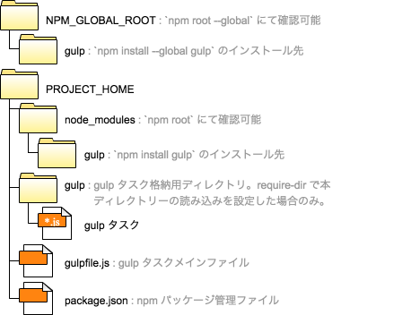
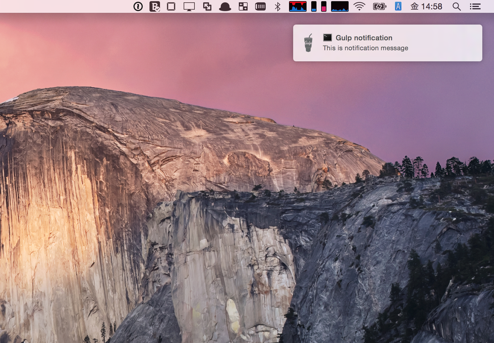
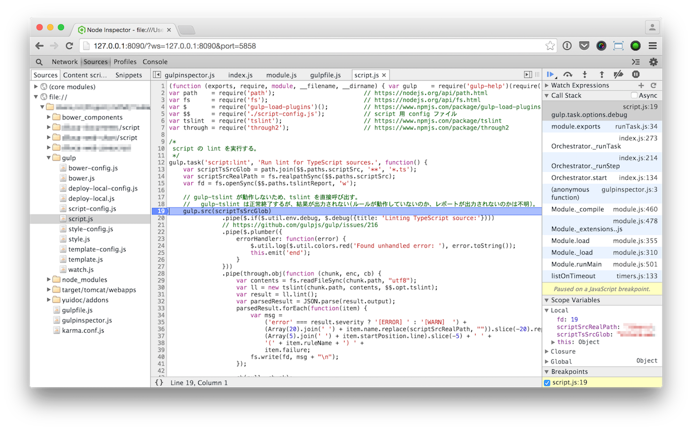

# 概要

本書では gulp の基本的な機能を解説する。
本書のステータスは Working Draft であり、本書に対するご意見は pull request にてお送りいただきたい。


# 動作環境の準備

## 前提

本書では以下の環境を前提とする。

```bash
% node -v                                                                                                                                                                                                    [.:develop:codeya.github.io]
v0.10.35
% npm -v                                                                                                                                                                                                     [.:develop:codeya.github.io]
1.4.28
```

## gulp のインストール

gulp はグローバルおよびプロジェクトローカルにそれぞれインストールする。
gulp は npm でインストールし、 package.json にてプロジェクトで使用するバージョンを管理する。

```bash
% npm install --global gulp
% npm install --save-dev gulp
% gulp -v                                                                                                                                                                              [+ .:feature/TBK-736_refactoring_gulpfile:Tsubaki]
[14:10:01] CLI version 3.9.0
[14:10:01] Local version 3.9.0
```

## gulp の最小設定

gulp の動作に必要な最小の gulpfile.js を作成する。

```bash
% vi ./gulpfile.js
% cat ./gulpfile.js
var gulp = require('gulp');
gulp.task('default', function() {});
% gulp
[13:49:57] Using gulpfile ~/gulpfile.js
[13:49:57] Starting 'default'...
[13:49:57] Finished 'default' after 39 μs
```

## Completion の設定

[Completion for gulp](https://github.com/gulpjs/gulp/tree/master/completion) に従い設定を行う。

## gulp のアップデート

gulp を最新にアップデートする方法を以下に示す。

```bash
% npm update --global gulp
% npm update --save-dev gulp
```


# gulp の構成




# gulp の実行

## gulp の実行

gulp にタスク名を指定して起動すると指定したタスクが実行される。
この場合、gulpfile.js はカレントディレクトリーに存在するものが使用される。

```bash
% gulp mytask
```

タスク名を指定しない場合は 'default' タスクが実行される。

```bash
% gulp
```

## 任意の gulpfile.js による gulp の実行

`--gulpfile` 引数を使用することで任意の gulpfile.js を使用して gulp を実行することができる。
カレントディレクトリーにない gulpfile.js を指定した場合は `--cwd` 引数を併せて指定しなければならないケースがある。

```bash
% gulp --gulpfile ./gulp/mytask.js --cwd . mytask
```


# タスク定義

## タスクの定義

タスクは以下のように定義する。

```javascript
var gulp = require('gulp');

gulp.task('taskname', function() {
  // do something.
});
```

## 依存タスクの定義

依存するタスクがある場合は以下のように定義することができる。

以下の例では `gulp taskB` を実行すると taskB の前に taskA が実行される。

```javascript
var gulp = require('gulp');

gulp.task('taskA', function() {
  // do something.
});

gulp.task('taskB', ['taskA'], function() {
  // do something.
});
```

## デフォルトタスクの定義

'default' タスクは、`gulp` が CLI オプションにてタスク指定なしで実行された際に使用される。

```javascript
var gulp = require('gulp');

gulp.task('default', ['build']);
```

```javascript
var gulp = require('gulp');

gulp.task('default', function() {
  // do something.
});
```

## ストリーム処理の定義

ストリームは `gulp.src()` にて作成し、`pipe()` にてストリームに対する処理を行う。
ストリームを `pipe()` で `gulp.dest()` に引き渡すことでストリームの内容をファイルシステムに書き出すことができる。

```javascript
var gulp = require('gulp');

gulp.task('dosomething', function() {
  gulp.src('src/**/*.js')
      .pipe(concat('app.js'))
      .pipe(gulp.dest('target'));
});
```

## ストリーム処理の条件付き実行

指定された条件にてストリーム処理の実行可否を切り替えることができる。

### 三項演算子によるストリーム処理の条件付き実行

JavaScript の三項演算子によりストリーム処理の条件付き実行を行うことができる。

以下の例では `enableUglify` 変数が `true` の場合のみ gulp-uglify が実行される。
なお、NOP は gulp-util プラグインの `noop()` で表すことができる。

```javascript
var gulp = require('gulp');
var gutil = require('gutil');
var uglify = require(`gulp-uglify`);

gulp.task('uglify', function() {
  var enableUglify = true;
  gulp.src('src/**/*.js')
      .pipe(enableUglify ? uglify() : gutil.noop()))
      .pipe(gulp.dest('target'));
});
```

### [gulp-load-plugins](https://www.npmjs.com/package/gulp-load-plugins) によるストリーム処理の条件付き実行

gulp-load-plugins の `if` によりストリーム処理の条件付き実行を行うことができる。

以下の例では `enableUglify` 変数が `true` の場合のみ gulp-uglify が実行される。

```javascript
var gulp = require('gulp');
var $ = require('gulp-load-plugins')();
var uglify = require(`gulp-uglify`);

gulp.task('uglify', function() {
  var enableUglify = true;
  gulp.src('src/**/*.js')
      .pipe($.if(enableUglify, uglify()))
      .pipe(gulp.dest('target'));
});
```

## イベントハンドリング

ストリーム処理の正常終了イベントは以下のように受け取ることができる。

```javascript
var gulp = require('gulp');

gulp.src(...)
    .pipe(...)
    .on('end', function(){
      // do something.
    });
```

ストリーム処理の異常終了イベントは以下のように受け取ることができる。

```javascript
var gulp = require('gulp');

gulp.src(...)
    .pipe(...)
    .on('error', function(){
      // do something.
    });
```

## カスタムストリーム処理の定義

through2 を使用することで、カスタムのストリーム処理を定義することができる。
処理中のファイルのパスは `chunk.path` で取得することができる。

```javascript
var gulp = require('gulp');
var through = require('through2');

gulp.task('dosomething', function() {
  gulp.src(scriptTsSrcGlob)
      .pipe(through.obj(function (chunk, enc, cb) {
        console.log("Processing a file : " + chunk.path);
        // do something.
        cb(null, chunk);
      }));
});
```

## watch

`gulp.watch` を使用することで、指定されたファイルの変更が検知された際にタスクを自動的に実行することができる。

以下の例では src 配下のファイルが変更された際に build タスクが実行される。

```javascript
var gulp = require('gulp');

gulp.task('build', function() {
  // do something.
});
gulp.task('watch', function() {
  gulp.watch(`src/**/*`, ['build']);
});
```

watch により呼び出されたタスクにてエラーが発生すると、watch コマンドが停止する。
エラーが発生した際においても watch コマンドを継続実行させるため、watch から呼び出されるタスクではエラーを適切にハンドリングする必要がある。

エラーハンドリング方法には様々な方法が存在するが、以下の例で示す [gulp プロジェクトの issue で議論された方法](https://github.com/gulpjs/gulp/issues/216)の使用を推奨する。
このエラーハンドリング方法を用いると、タスクが直接呼び出された場合においても、watch 経由で呼び出された場合においても問題無く動作する。

```javascript
var gulp = require('gulp');
var plumber = require('gulp-plumber');

gulp.task('build', function() {
    return gulp.src('src/**/*')
               .pipe(plumber({  // error handling
                   errorHandler: function(error) {
                       console.log(error.toString());
                       this.emit('end');
                   }
               }))
               .pipe(...)
               .pipe(plumber.stop())  // error handling
               .pipe(gulp.dest('target'))
});
```


# タスク、ストリームの処理順序

gulp ではタスクやストリームは基本的に並列処理されるため、gulpfile.js のコードと実際の処理順序は異なるケースが発生する。
本章ではタスクやストリームについて逐次/並列処理の制御方法を紹介する。

## タスクの並列処理

以下の例では `gulp taskB` を実行した際、taskA と taskB が並列処理される。

```javascript
var gulp = require('gulp');

gulp.task('taskA', function() {
  gulp.src(...).pipe(...);
});

gulp.task('taskB', ['taskA'], function() {
  gulp.src(...).pipe(...);
});
```

## タスクの逐次処理

以下の例では `gulp taskB` を実行した際、taskA と taskB が逐次処理される。
taskA がストリームを返すことで taskA の完了を待った後で taskB が処理されるようになる。

```javascript
var gulp = require('gulp');

gulp.task('taskA', function() {
  return gulp.src(...).pipe(...);
});

gulp.task('taskB', ['taskA'], function() {
  gulp.src(...).pipe(...);
});
```

先に実行されるタスクが複数のストリームを処理する場合、[merge-stream](https://www.npmjs.com/package/merge-stream) を使用してマージしたストリームを返さなければならない。
なお、gulp-util でもストリームをマージする combine 機能が提供されるが、combine では逐次処理とならないため注意が必要。

```javascript
var merge = require('merge-stream');

gulp.task('taskA', function() {
  return merge(
    gulp.src(...).pipe(...),
    gulp.src(...).pipe(...)
  );
});

gulp.task('taskB', ['taskA'], function() {
  gulp.src(...).pipe(...);
});
```

## [run-sequence](https://www.npmjs.com/package/run-sequence) によるタスクの逐次/並列処理

run-sequence によりタスクの逐次/並列処理を管理することができる。

以下の例では taskA が終了後に taskB と taskC が並列処理される。
run-sequence で制御する場合においても、逐次処理にて終了待ちとなる taskA はストリームを返さなければならない。
taskB および taskC についてはタスクの戻り値に関わらず並列処理される。

```javascript
var gulp = require('gulp');
var seq = require('run-sequence');

gulp.task('dosomething', function(cb) {
  seq('taskA', ['taskB', 'taskC'], cb);
});

gulp.task('taskA', function(cb) {
  return gulp.src(...).pipe(...);
});

gulp.task('taskB', function(cb) {
  gulp.src(...).pipe(...);
});

gulp.task('taskC', function(cb) {
  gulp.src(...).pipe(...);
});
```

## [gulp-async-tasks](https://www.npmjs.com/package/gulp-async-tasks) による並列処理用タスクの自動生成

gulp-async-tasks により並列処理用のタスク定義を自動的に作成することができる。
タスク定義は全て逐次処理用(ストリームを返すタスク)としておき、gulp-async-tasks により並列処理用タスク(ストリームを返さないタスク)を自動生成することでタスク定義の肥大化を防ぎつつ柔軟な逐次/並列処理の制御が可能となる。

以下の例では taskA と taskB は逐次処理、taskA と taskC は並列処理となる。

```JavaScript
var gulp = require('gulp-async-tasks')(require('gulp'));

gulp.task('taskA', function() {
  return gulp.src(...).pipe(...);
});
gulp.task('taskB', ['taskA']);
gulp.task('taskC', ['taskA:async']);
```

## watch によるファイル更新検出時のタスクの逐次処理

watch により複数のタスクを逐次処理にて実行したい場合は以下のように `change` イベントと run-sequence を使用する。

```JavaScript
var gulp = require('gulp');
var seq = require('run-sequence');

gulp.task('taskA', function() {
  return gulp.src(...).pipe(...);
});
gulp.task('taskB', function() {
  gulp.src(...).pipe(...);
});
gulp.task('watch', function() {
  gulp.watch('src/**/*').on('change', function() {
    seq('taskA', 'taskB');
  });
}
```

## ストリームの並列処理

タスク内で複数ストリームを定義すると、ストリームは並列処理される。

以下の例では dosomething タスクにおいて stream 1 と 2 が生成され、これらは並列に処理される。

```javascript
var gulp = require('gulp');

gulp.task('dosomething', function() {
  gulp.src(...).pipe(...); // stream 1
  gulp.src(...).pipe(...); // stream 2
});
```

## ストリームの逐次処理

ストリームを逐次処理する場合は `end` イベントを用いる。

以下の例では dosomething タスクにおいて stream 1 の処理完了後に stream 2 が実行される。

```javascript
var gulp = require('gulp');

gulp.task('dosomething', function() {
  gulp.src(...)                   // stream 1
      .pipe(...)
      .on('end', function() {
        gulp.src(...).pipe(...);  // stream 2
      });
});
```


# プラグイン

プラグインは [npm](https://www.npmjs.com/) もしくは [gulp - Plugins](http://gulpjs.com/plugins/) にて多数公開されている。
本章では汎用的に利用可能なプラグインを紹介する。

## [gulp-load-plugins](https://www.npmjs.com/package/gulp-load-plugins)

gulp-load-plugins により prefix として 'gulp-' や 'gulp.' を持つ plugin を require せずに参照できる。
gulp-load-plugins によるプラグイン参照は、以下のルールに従う。

* prefix の 'gulp-' や 'gulp.' は削除する。例) 'gulp-util' → 'util'
* プラグイン名は prefix を除外した後、lowerCaseCamelNotation に変換する。例) 'gulp-minify-css' → 'minifyCss'

require は不要となるが、使用するプラグインは事前に `npm install` しておく必要がある。

以下の例では 'gulp-util' を `$.util` として参照している。

```javascript
var $ = require('gulp-load-plugins')();

$.util.log("Hello, gulp");
```

## [require-dir](https://www.npmjs.com/package/require-dir)

指定されたディレクトリー内の js ファイルをタスク定義として読み込む。
タスクを複数の js ファイルに分割して管理する際に利用する。

以下の例では gulp ディレクトリー内のファイルを参照しており、`gulp dosomething` を実行することで gulp/dosomething.js に定義されているタスクを実行することができる。

```javascript
// gulpfile.js
require('require-dir')('./gulp');

// gulp/dosomething.js
var gulp = require('gulp');
gulp.task('dosomething', function() {
  // do something.
});
```

## [gulp-util](https://www.npmjs.com/package/gulp-util)

gulp-util はタスク定義で使用できる様々なユーティリティーを提供する。

### ログ出力

タスクにてログを出力する場合は gulp-util の `log` を用いる。

```javascript
var gutil = require('gulp-util');

gutil.log('Hello, gulp!');
```

### ログ出力(カラー)

gulp-util の `colors` によりログメッセージにカラーを付けることができる。
使用可能なカラーは [ansi-styles](https://github.com/chalk/ansi-styles)を参照。

```javascript
var gutil = require('gulp-util');

gutil.log(gutil.colors.red('Hello, gulp!'));
```

### CLI オプションの参照

gulp-util の `env` により CLI オプションを参照することができる。

以下の例では `gulp --debug` として gulp が起動された場合に gulp-debug が実行される。

```javascript
var gulp = require('gulp');
var gutil = require('gulp-util');
var debug = require('gulp-debug');

gulp.src(...)
    .pipe($.if(gutil.env.debug, debug()))
    .pipe(gulp.dest(...));
```

## [gulp-help](https://www.npmjs.com/package/gulp-help)

gulp-help によりヘルプを作成することができる。

```javascript
var gulp = require('gulp-help')(require('gulp'));

gulp.task('dosomething', 'Do something.', function() {
  // do something.
}, {
  options: {
    'attr': 'Custom attribute'
  }
});
```

`gulp help` を実行することで以下のヘルプメッセージが表示される。

```
% gulp help
[08:54:26] Using gulpfile ~/gulpfile.js
[08:54:26] Starting 'help'...

Usage
  gulp [TASK] [OPTIONS...]

Available tasks
  dosomething      Do something.
   --attr          Custom attribute
  help             Display this help text.

[08:54:26] Finished 'help' after 687 μs
```

## [gulp-notify](https://www.npmjs.com/package/gulp-notify)

gulp-notify によりユーザー通知を行うことができる。

以下の例では処理が完了したタイミングでユーザーに通知を行う。

```javascript
var gulp = require('gulp');
var notify = require('gulp-notify');

gulp.src(...)
    .pipe(gulp.dest(...))
    .pipe(notify('This is notification message'));
```



## [gulp-debug](https://www.npmjs.com/package/gulp-debug)

gulp-debug により処理対象のファイルを一覧表示することができる。

```javascript
var gulp = require('gulp');
var debug = require('gulp-debug');

gulp.src(...)
    .pipe(debug({title: 'Processing:'}))
    .pipe(gulp.dest(...));
```

## [gulp-run](https://www.npmjs.com/package/gulp-run)

gulp-run によりシェルコマンドを実行することができる。

```javascript
var run = require('gulp-run');

run('ls').exec();
```

## [gulp-mode](https://www.npmjs.com/package/gulp-mode)

gulp-mode によりビルドモード(production/development)の切替ができる。

```javascript
var gulp = require('gulp');
var mode = require('gulp-mode')();

gulp.src(...)
    .pipe(mode.production(...))
    .pipe(mode.development(...))
    .pipe(gulp.dest(...));
```

```bash
% gulp --production
```


# ファイル操作

タスク定義にて使用できる基本的なファイル操作方法を紹介する。

## ファイルのコピー

`gulp.src` をそのまま `gulp.dest` に引き渡すことでファイル、ディレクトリーをコピーすることができる。

以下の例では from ディレクトリー配下を全て to ディレクトリーにコピーする。

```javascript
var gulp = require('gulp');

gulp.src('from/**')
    .pipe(gulp.dest('to'));
```

## ファイルの削除

del によりファイル、ディレクトリーを削除することができる。

以下の例では deletee1、deletee2 を削除する。

```javascript
var gulp = require('gulp');
var del = require('del');

gulp.task('clean', function(cb) {
  del(['deletee1', 'deletee2'], cb);
});
```

## ファイルの書き出し

fs によりファイルに任意のデータを書き出すことができる。

```javascript
var fs = require('fs');
var fd = fs.openSync('file.txt', 'w');
fs.write(fd, "Hello, gulp!");
fs.closeSync(fd);
```

## ファイルのマージ

gulp-concat によりファイルをマージすることができる。

以下の例では src 配下の全ての js ファイルをマージして target/app.js に書き出す。

```javascript
var gulp = require('gulp');
var concat = require('gulp-concat');

gulp.src('src/**/*.js')
    .pipe(concat('app.js'))
    .pipe(gulp.dest('target'));
```

## ファイルのリネーム

gulp-rename2 によりファイルをリネームすることができる。

以下の例では src 配下の全ての html ファイルについて拡張子を '.html' から '.jsp' に変更し target 以下に書き出す。

```javascript
var gulp = require('gulp');
var rename2 = require('gulp-rename2');

gulp.src('src/**/*.html')
    .pipe($.rename2(function (pathObj, filePath) {
      return pathObj.join(
          pathObj.dirname(filePath),
          pathObj.basename(filePath, '.html') + '.jsp'
      );
    }, { verbose: false }))
    .pipe(gulp.dest('target'));
```

## パスの作成

path によりパスを作成することができる。

以下の例では 'src'、'**'、'*.ts' から 'src/**/*.ts' を作成する。

```javascript
var path = require('path');
var srcGlob = path.join('src', '**', '*.ts');
```

## 絶対パスの取得

fs により相対パスを絶対パスに変換することができる。

```javascript
var srcRealPath = fs.realpathSync('src');
```


# gulpfile.js のデバッグ

[node-inspector](https://github.com/node-inspector/node-inspector) により gulpfile.js のデバッグを行うことができる。

## node-inspector のインストール

```bash
% npm install --global node-inspector
```

## gulpinspector.js の作成

node から gulp を呼び出すためのラッパー(ここでは gulpinspector.js とする)を作成する。

```JavaScript
var task = process.argv.length > 2 ? process.argv[2] : "default";
require('./gulpfile.js');
require('gulp').start(task);
```

以下のように gulpinspector.js の動作を確認する。
それぞれ、'default' タスクおよび指定したタスクが正常に動作することを確認する。

```bash
% node ./gulpinspector.js
% node ./gulpinspector.js mytask
```

## デバッグ

ターミナルを 2 つ用意し、それぞれ以下のコマンドを実行する。

```bash
% node --debug-brk ./gulpinspector.js mytask
debugger listening on port 5858
```

```bash
% node-inspector --web-port=8090
Node Inspector v0.12.2
Visit http://127.0.0.1:8090/?ws=127.0.0.1:8090&port=5858 to start debugging.
```

node-inspector が起動したら Web ブラウザーで "http://127.0.0.1:8090/?ws=127.0.0.1:8090&port=5858" を開く。
先頭行にブレイクポイントが設定され処理が停止した状態となっているので、適宜ブレイクポイントの設定やステップ実行などを行いデバッグする。


